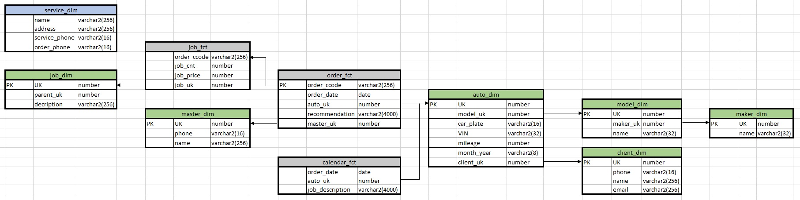

***
Logical model
====

In this project, there are two fact tables and several dimension tables. The star scheme is used. Also, uses the dimension table with service's details.

At the [Excel](./LM_ArtAuto_v1.0.xlsx) file you might find more details about the logical model of the project.